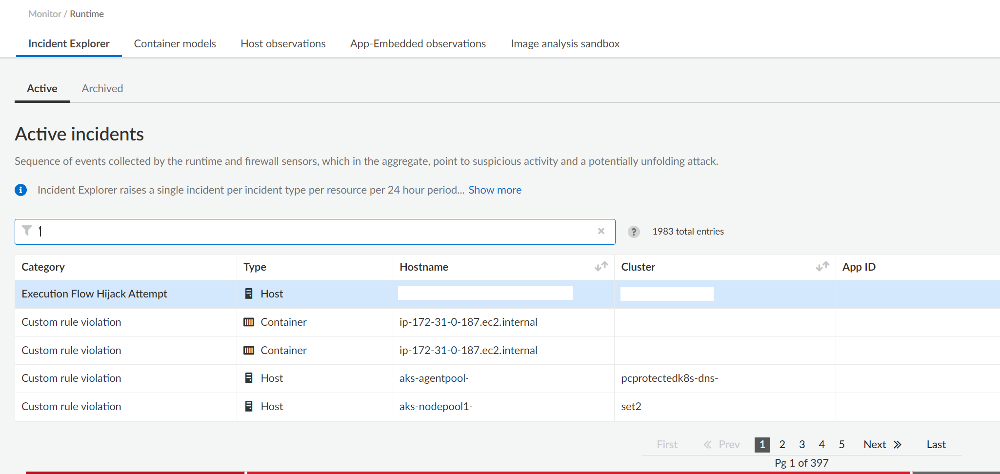

# Batch archive Runtime Incidents

Simple bash script to archive all the incidents in the Compute->Monitor->Runtime->Incident Explorer screen

Note that the archived incidents won't be actually deleted, but simply flagged and moved to the "Archived" incident tab

